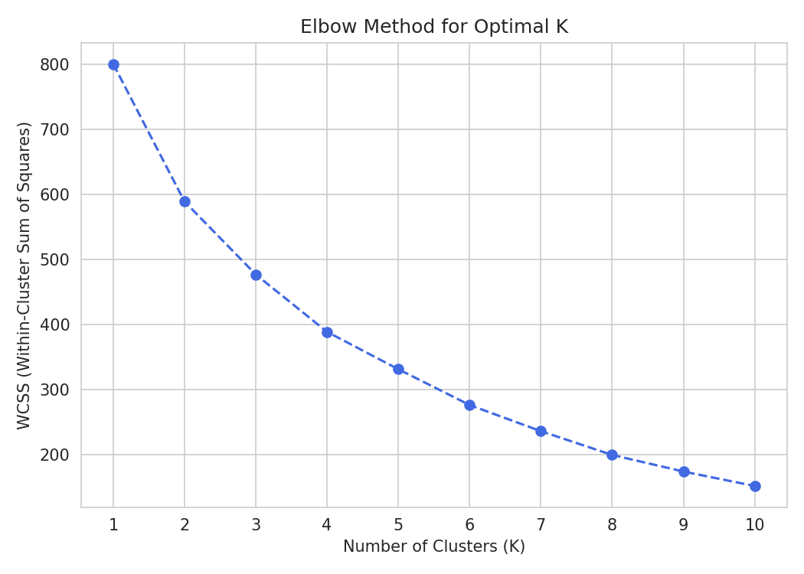
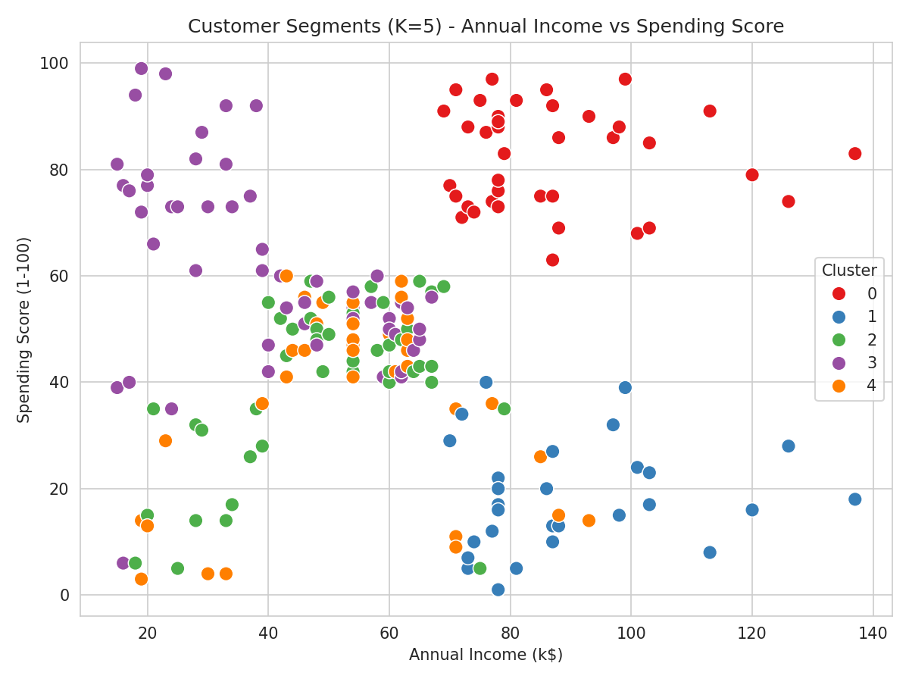
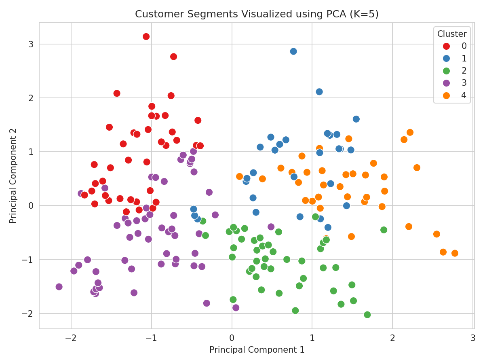

# Customer Segmentation using K-Means Clustering and PCA


## Objective

A shopping mall wants to divide its customers into different groups based on their annual income and spending behavior, so that the management can run targeted marketing campaigns. This project builds a **K-Means Clustering** model to segment mall customers, and applies **Principal Component Analysis (PCA)** to visualize the resulting clusters in two dimensions.

## Dataset

**Mall Customer Segmentation Dataset**
Kaggle Link: https://www.kaggle.com/datasets/vjchoudhary7/customer-segmentation-tutorial-in-python

The dataset (`data/Mall_Customers.csv`) contains 200 customer records with the following columns:

| Column | Description |
|---|---|
| `CustomerID` | Unique identifier for each customer (dropped before modeling) |
| `Gender` | Male / Female |
| `Age` | Customer's age |
| `Annual Income (k$)` | Customer's annual income in thousand dollars |
| `Spending Score (1-100)` | Score assigned by the mall based on customer spending behavior |

## Libraries Used

- `pandas` – data loading and manipulation
- `numpy` – numerical operations
- `matplotlib` / `seaborn` – data visualization
- `scikit-learn` – `StandardScaler`, `LabelEncoder`, `KMeans`, `PCA`

Install all dependencies with:

```bash
pip install -r requirements.txt
```

## Repository Structure

```
.
├── Assignment-7.ipynb      # Main Jupyter notebook (all tasks, code + outputs)
├── README.md                # This file
├── requirements.txt         # Python dependencies
├── data/
│   └── Mall_Customers.csv   # Dataset used for the assignment
└── images/
    ├── elbow_curve.png          # Elbow Method plot
    ├── cluster_scatter.png      # Cluster scatter plot (Income vs Spending Score)
    └── pca_visualization.png    # PCA 2D visualization with cluster labels
```

## Methodology

**Task 1 – Data Understanding**
- Loaded the dataset with Pandas and inspected the first five records.
- Identified numerical features (`Age`, `Annual Income (k$)`, `Spending Score (1-100)`) and the categorical feature (`Gender`).
- Reviewed `df.info()` and `df.describe()` for structure and summary statistics.

**Task 2 – Data Preprocessing**
- Verified there were no missing values in the dataset.
- Dropped the `CustomerID` column, since it is just an identifier and carries no predictive information.
- Encoded the categorical `Gender` column using `LabelEncoder` (Female = 0, Male = 1).
- Standardized all features (`Age`, `Annual Income (k$)`, `Spending Score (1-100)`, `Gender`) using `StandardScaler` so that no single feature dominates the distance calculations used by K-Means.

**Task 3 – Model Development**
- Used the **Elbow Method** (WCSS vs. K for K = 1 to 10) to find the optimal number of clusters.
- Trained a `KMeans` model with the selected **K = 5**.
- Assigned a `Cluster` label to every customer.
- Applied **PCA** to reduce the standardized 4-feature dataset down to 2 principal components for visualization.

**Task 4 – Visualization and Evaluation**
- Plotted the Elbow Curve to justify the choice of K.
- Plotted customer clusters using `Annual Income (k$)` vs `Spending Score (1-100)`.
- Plotted the PCA-reduced 2D representation of the clusters.

**Task 5 – Conclusion**
- Summarized key findings, business applications, a limitation of K-Means, and an advantage of PCA.

## Results

**Optimal number of clusters:** K = 5 (identified via the Elbow Method)

**Elbow Curve:**



**Customer Clusters (Annual Income vs Spending Score):**



**PCA Visualization of Clusters:**



**Cluster Profile Summary:**

| Cluster | Avg. Age | Avg. Annual Income (k$) | Avg. Spending Score | Count | Segment |
|---|---|---|---|---|---|
| 0 | 32.7 | 86.5 | 82.1 | 39 | High income, high spending — premium/target customers |
| 1 | 36.5 | 89.5 | 18.0 | 29 | High income, low spending — careful/cautious spenders |
| 2 | 49.8 | 49.2 | 40.1 | 43 | Average income, average spending — standard customers |
| 3 | 24.9 | 39.7 | 61.2 | 54 | Low income, high spending — impulsive/young spenders |
| 4 | 55.7 | 53.7 | 36.8 | 35 | Average income, below-average spending — older, moderate spenders |

*(PCA note: the first two principal components together explain roughly 60% of the total variance in the standardized data — enough to reveal clear, well-separated cluster structure in 2D.)*

### Observations

1. **Optimal number of clusters:** The WCSS drops sharply up to K = 5 on the Elbow Curve and flattens out afterward, marking K = 5 as the point of diminishing returns and the best trade-off between simplicity and cluster compactness.
2. **How PCA helps visualize high-dimensional data:** The dataset has 4 standardized features, too many to plot directly. PCA compresses these into 2 principal components that retain most of the meaningful variance, making it possible to visually confirm that the K-Means clusters are well separated.
3. **Characteristics of the identified customer groups:** The 5 clusters map to intuitive real-world segments — e.g., high-income/high-spending "premium" customers, high-income/low-spending "cautious" customers, and low-income/high-spending "impulsive" customers — each of which calls for a different marketing strategy.
4. **Consistency across visualizations:** The groupings in the raw Income-vs-Spending scatter plot closely mirror the groupings in the PCA plot, confirming that dimensionality reduction did not distort the underlying cluster structure.

## Conclusion

In this assignment, K-Means clustering was applied to the Mall Customer Segmentation dataset to group 200 customers into 5 distinct segments based on their age, annual income, spending score, and gender. The Elbow Method confirmed K = 5 as the optimal number of clusters, and PCA was used to compress the standardized features into two principal components for clear 2D visualization, showing well-separated customer groups. These segments can help the mall's marketing team design targeted campaigns — for example, offering premium loyalty programs to high-income, high-spending customers, and discount-driven promotions to low-income, high-spending customers — improving marketing ROI and customer retention. A key limitation of K-Means is that it requires the number of clusters (K) to be specified in advance and assumes roughly spherical, similarly-sized clusters, which may not always reflect real customer behavior. An advantage of PCA is that it reduces dimensionality while retaining most of the data's variance, making complex, multi-feature data much easier to visualize and interpret without significant loss of information.

## How to Run

```bash
git clone https://github.com/Sagar-projects803/Customer-Segmentation.git
cd Customer-Segmentation
pip install -r requirements.txt
jupyter notebook Assignment-7.ipynb
```

